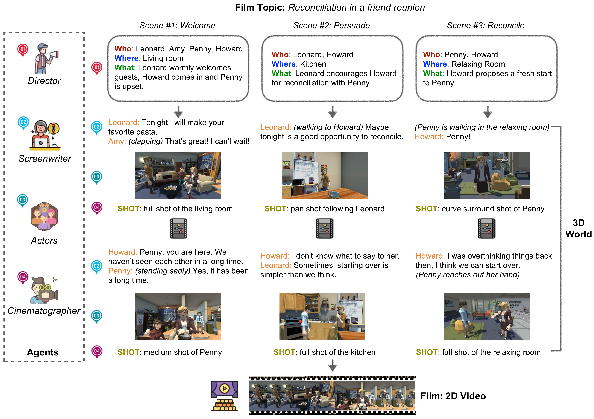

# CinePilot-Multi-Agent-Framework-for-Cinema-Preproduction
CinePilot simulates key crew roles - directors, screenwriters, actors, and cinematographers to automate the preproduction

  
  
<em>Figure: FilmAgent is a multi-agent collaborative system for end-to-end film automation in 3D virtual spaces. FilmAgent simulates key crew roles—directors, screenwriters, actors, and cinematographers, and integrates efficient human workflows within a sandbox environment.</em>

